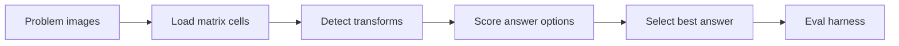

# Visual Analogy Agent (Raven's Progressive Matrices)

A classical AI agent that solves **Raven's Progressive Matrices** — visual analogy
puzzles in **2×2** and **3×3** formats — by comparing pixel-level transformations
(rotation, reflection, fill, shape change) rather than learning from labeled data.

The point of this repo is not a neural net. It is a transparent, inspectable
*reasoning* pipeline: detect candidate transforms between matrix cells, score
answer options against those transforms, and pick the best match.

## Scorecard

Evaluation harness grades agent answers against known solutions (12 problems per
set). Results from a full local run:

| Problem set | Correct | Incorrect | Accuracy |
|-------------|---------|-----------|----------|
| Basic Problems B | 10 | 2 | **83%** |
| Basic Problems C | 10 | 2 | **83%** |
| Basic Problems D | 12 | 0 | **100%** |
| Basic Problems E | 12 | 0 | **100%** |
| Challenge Problems B | 6 | 6 | 50% |
| Challenge Problems C | 11 | 1 | **92%** |
| Challenge Problems D | 7 | 5 | 58% |
| Challenge Problems E | 2 | 10 | 17% |
| **Basic (all)** | **44** | **4** | **92%** |
| **Challenge (all)** | **26** | **22** | **54%** |
| **Overall** | **70** | **26** | **73%** |

Artifacts: [`SetResults.csv`](SetResults.csv), [`ProblemResults.csv`](ProblemResults.csv).

Basic sets (especially D/E) are near-ceiling. Challenge E remains the hardest —
mostly complex 3×3 compositions where pixel heuristics underfit.

## Architecture



| Layer | Role |
|-------|------|
| [`Agent.py`](Agent.py) | Core solver — 2×2 and 3×3 visual analogy logic |
| [`RavensProblem.py`](RavensProblem.py) / [`RavensFigure.py`](RavensFigure.py) | Problem and figure representations |
| [`ProblemSet.py`](ProblemSet.py) | Loads problem folders under `Problems/` |
| [`RavensProject.py`](RavensProject.py) | Batch runner — writes `AgentAnswers.csv` |
| [`RavensGrader.py`](RavensGrader.py) | Compares answers to ground truth; writes scorecards |

**How the agent reasons (high level):**

1. Open matrix cells as images (Pillow); measure dark-pixel fill and pairwise RMS /
   difference maps (NumPy / pixel ops).
2. For **2×2**: test equality, left–right / top–bottom reflection, and rotations
   between A→B and A→C; apply the same transform from the remaining cell to each
   candidate answer.
3. For **3×3**: compare diagonal, row, and column relations; score each option
   with composition heuristics (union of horizontal / vertical / diagonal
   transforms).
4. Return the option index (1–6 or 1–8) with the best score; never skip
   (`ans = -1`).

## Setup

```bash
python3 -m venv .venv
source .venv/bin/activate
pip install -e ".[dev]"
# or: pip install -r requirements.txt
```

Requires Python 3.9+.

## Run

Solve every set listed in [`Problems/ProblemSetList.txt`](Problems/ProblemSetList.txt)
and grade:

```bash
python RavensProject.py
```

Outputs:

- `AgentAnswers.csv` — raw agent choices  
- `ProblemResults.csv` — per-problem correct / incorrect  
- `SetResults.csv` — per-set totals  

Smoke tests (a few Basic problems):

```bash
pytest
```

## What's inside

```
RPM_AI_Python/
├── Agent.py              # visual analogy agent
├── RavensProject.py      # batch solve + grade entrypoint
├── RavensGrader.py       # evaluation harness
├── Problems/             # Basic + Challenge sets (B–E)
├── tests/                # pytest smoke on Basic problems
├── SetResults.csv        # scorecard by set
├── ProblemResults.csv    # per-problem outcomes
├── requirements.txt
└── pyproject.toml
```

## Practical use

- **Cognitive / classical AI demo** — show symbolic-style visual reasoning without
  deep learning.
- **Agent evaluation harness** — same grader pattern as any policy under a fixed
  problem suite: generate answers → score → report set-level accuracy.
- **Failure analysis** — Challenge E highlights where pixel heuristics break on
  richer compositions (candidate area for verbal attributes or learned features).

## Disclaimer

Educational research / portfolio project. Problem images are for evaluating the
agent, not for redistribution as a commercial puzzle product.

## License

All Rights Reserved. See [LICENSE](LICENSE).
