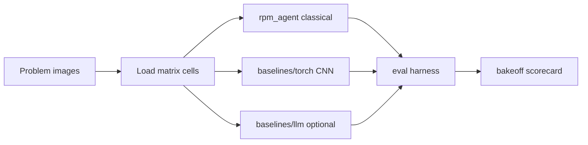

# Visual Analogy Agent (Raven's Progressive Matrices)

A classical AI agent that solves **Raven's Progressive Matrices** — visual analogy
puzzles in **2×2** and **3×3** formats — by comparing pixel-level transformations
(rotation, reflection, fill, shape change) rather than learning from labeled data.

The point of this repo is not a neural net as the default. It is a transparent,
inspectable *reasoning* pipeline: detect candidate transforms between matrix cells,
score answer options against those transforms, and pick the best match. A small
CNN embedding baseline and an optional VLM/LLM stub sit beside it for method
comparison (bake-off).

## Business problem

Visual analogy (A∶B ∷ C∶?) is a compact test of structured perception: the system
must notice *relations* between figures, not just classify objects. Portfolio and
teaching use cases need a solver that is **inspectable**, cheap to run offline,
and easy to grade against a fixed problem suite — with room to compare classical
heuristics against learned embeddings or language-model stubs under the same
harness.

## Scorecard (classical agent)

Evaluation harness grades agent answers against known solutions (12 problems per
set). Results from a full local run of the **classical** `rpm_agent` solver:

| Problem set | Correct | Incorrect | Accuracy |
|-------------|---------|-----------|----------|
| Basic Problems B | 10 | 2 | **83%** |
| Basic Problems C | 10 | 2 | **83%** |
| Basic Problems D | 12 | 0 | **100%** |
| Basic Problems E | 12 | 0 | **100%** |
| Challenge Problems B | 6 | 6 | 50% |
| Challenge Problems C | 11 | 1 | **92%** |
| Challenge Problems D | 7 | 5 | 58% |
| Challenge Problems E | 2 | 10 | 17% |
| **Basic (all)** | **44** | **4** | **92%** |
| **Challenge (all)** | **26** | **22** | **54%** |
| **Overall** | **70** | **26** | **73%** |

Artifacts: [`SetResults.csv`](SetResults.csv), [`ProblemResults.csv`](ProblemResults.csv).

Basic sets (especially D/E) are near-ceiling. Challenge E remains the hardest —
mostly complex 3×3 compositions where pixel heuristics underfit.

Bake-off smoke subset (Basic Problems B, first 3 — **not** full eval), measured locally:

| Method | Correct / N | Accuracy | Notes |
|--------|-------------|----------|-------|
| Classical | 3 / 3 | **100%** | smoke subset |
| Torch (untrained smoke weights) | 3 / 3 | **100%** | smoke subset |
| LLM | — | skipped | provider/key unset |

See `artifacts/bakeoff_scorecard.json` after `scripts/run_bakeoff.py`.

## Architecture

Three solvers share the same problem loaders and grading path:



| Layer | Role |
|-------|------|
| [`rpm_agent/`](rpm_agent/) | Default classical solver — `detect` → `score` → `compose` + typed `Agent` |
| [`baselines/torch/`](baselines/torch/) | Tiny CNN encoder + embedding analogy arithmetic (offline smoke weights) |
| [`baselines/llm/`](baselines/llm/) | Env-gated VLM/LLM stub; skipped when provider/key unset (CI-safe) |
| [`eval/`](eval/) | Shared harness + comparative scorecard writer |
| [`Agent.py`](Agent.py) | Compatibility shim (`from rpm_agent import Agent`) |
| [`RavensProblem.py`](RavensProblem.py) / [`RavensFigure.py`](RavensFigure.py) | Problem and figure representations |
| [`ProblemSet.py`](ProblemSet.py) | Loads problem folders under `Problems/` |
| [`RavensProject.py`](RavensProject.py) | Batch runner — writes `AgentAnswers.csv` |
| [`RavensGrader.py`](RavensGrader.py) | Compares answers to ground truth; writes scorecards |
| [`scripts/emit_eval_metrics.py`](scripts/emit_eval_metrics.py) | CI artifact from `SetResults.csv` → `artifacts/eval_metrics.json` |
| [`scripts/run_bakeoff.py`](scripts/run_bakeoff.py) | Classical + torch (+ LLM if env) on a small subset |

**How the classical agent reasons (high level):**

1. Open matrix cells as images (Pillow); measure dark-pixel fill and pairwise RMS /
   difference maps (NumPy / pixel ops).
2. For **2×2**: test equality, left–right / top–bottom reflection, and rotations
   between A→B and A→C; apply the same transform from the remaining cell to each
   candidate answer.
3. For **3×3**: compare diagonal, row, and column relations; score each option
   with composition heuristics (union of horizontal / vertical / diagonal
   transforms).
4. Return the option index (1–6 or 1–8) with the best score; never skip
   (`ans = -1`).

**Torch baseline:** embed each cell with a tiny CNN; score answers by similarity of
`C + (B − A)` (and transform nearest-neighbor). Weights are fixed random-init
smoke weights — not trained on RPM data.

**LLM baseline:** if `VISUAL_ANALOGY_LLM_PROVIDER` (and an API key) is unset, the
method is recorded as skipped. When set, a local fill-ratio stub documents the
interface without requiring network calls for CI.

## Method tradeoffs

| Method | Accuracy | Interpretability | Cost | Latency |
|--------|----------|------------------|------|---------|
| Classical (`rpm_agent`) | Strong on Basic sets (measured full suite above) | High — explicit transforms | CPU-only, no API | Low (ms–s / set) |
| Torch embedding | Depends on weights; smoke uses untrained CNN | Medium — vector arithmetic, opaque features | Optional `torch` install; no GPU required for smoke | Low–medium |
| LLM / VLM stub | Untested in CI (skipped by default) | Low–medium — prompt/policy opaque | API $ when live | Higher; network RTT |

## Technologies

Python 3.9+ · Pillow · NumPy · pytest · (optional) PyTorch

## Setup

```bash
python3 -m venv .venv
source .venv/bin/activate
pip install -e ".[dev]"
# optional CNN baseline:
pip install -e ".[torch]"
```

Or: `pip install -r requirements.txt`.

## Run

Solve every set listed in [`Problems/ProblemSetList.txt`](Problems/ProblemSetList.txt)
and grade:

```bash
python RavensProject.py
```

Outputs:

- `AgentAnswers.csv` — raw agent choices  
- `ProblemResults.csv` — per-problem correct / incorrect  
- `SetResults.csv` — per-set totals  

Smoke (pytest + eval metrics + bake-off):

```bash
./scripts/smoke.sh
# or:
pytest
python scripts/emit_eval_metrics.py
python scripts/run_bakeoff.py
```

Optional LLM bake-off participation:

```bash
export VISUAL_ANALOGY_LLM_PROVIDER=stub
export VISUAL_ANALOGY_LLM_API_KEY=unused-for-stub
python scripts/run_bakeoff.py
```

## What's inside

```
visual-analogy-agent/
├── rpm_agent/            # classical default solver
├── baselines/torch/      # tiny CNN embedding baseline
├── baselines/llm/        # optional VLM/LLM stub
├── eval/                 # shared harness + scorecard
├── Agent.py              # shim → rpm_agent.Agent
├── RavensProject.py      # batch solve + grade entrypoint
├── RavensGrader.py       # evaluation harness
├── Problems/             # Basic + Challenge sets (B–E)
├── scripts/smoke.sh
├── scripts/run_bakeoff.py
├── tests/
├── SetResults.csv
├── ProblemResults.csv
├── requirements.txt
└── pyproject.toml
```

## Practical use

- **Cognitive / classical AI demo** — show symbolic-style visual reasoning without
  deep learning as the default path.
- **Method bake-off** — same problems, three solvers, one scorecard JSON.
- **Agent evaluation harness** — generate answers → score → report set-level accuracy.
- **Failure analysis** — Challenge E highlights where pixel heuristics break on
  richer compositions (candidate area for verbal attributes or learned features).

## Future improvements

- Train the torch encoder on synthetic RPM transforms (still keep classical default).
- Wire a real VLM provider behind `baselines/llm` `live` mode with rate limits.
- Expand bake-off subset / full-suite comparative runs in CI artifacts.
- Verbal-attribute features for Challenge E compositions.
- Export per-transform classical explanations alongside answer indices.

## Disclaimer

Educational research / portfolio project. Problem images are for evaluating the
agent, not for redistribution as a commercial puzzle product.

## License

All Rights Reserved. See [LICENSE](LICENSE).
